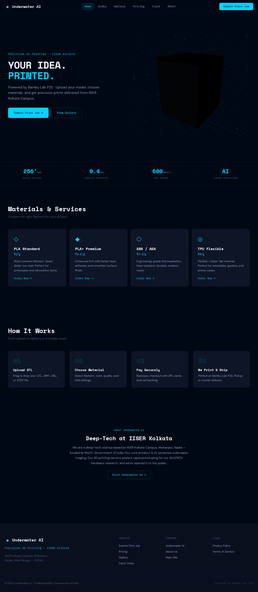

# Underwater AI — 3D Printing Service

Production-grade 3D printing service website powered by Bambu Lab P2S, based at IISER Kolkata Campus, Mohanpur, Nadia, West Bengal. Funded by MeitY, Government of India.

**Live Site:** https://underwater-ai.github.io/3d_printing/

## Screenshot



## Quick Start

### Frontend Only

```bash
git clone git@github.com:Underwater-AI/3d_printing.git
cd 3d_printing/client
npm install
npm run dev        # → http://localhost:5173
```

### Full Stack

```bash
git clone git@github.com:Underwater-AI/3d_printing.git
cd 3d_printing
cp .env.example .env
# Edit .env with your keys (see Environment Variables below)

# Terminal 1 — Server
cd server && npm install && npm run dev   # → http://localhost:5000

# Terminal 2 — Client
cd client && npm install && npm run dev   # → http://localhost:5173
```

The Vite dev server proxies `/api` and `/uploads` to `localhost:5000` automatically.

### Docker (Production)

```bash
docker-compose up --build
# → http://localhost:5000 (serves both API and built frontend)
```

## Features

- **3D Model Upload** — Drag-and-drop upload for STL, 3MF, OBJ, STEP files (up to 100MB)
- **Live Price Estimation** — Real-time pricing based on material, weight, quantity, and delivery
- **Material Selection** — PLA, PLA+, PETG, ABS, ASA, TPU, PA-CF with properties and colors
- **Razorpay Payments** — Secure payment flow with signature verification and webhooks
- **Order Tracking** — Track print job status by ID with timeline view
- **Admin Dashboard** — Job queue management, revenue stats, status updates
- **3D Printer Scene** — Interactive Three.js viewer with Bambu Lab P2S model
- **Responsive Design** — Mobile-first with fluid typography and adaptive layouts
- **Email Notifications** — Order confirmation and admin alert emails via Nodemailer

## Tech Stack

| Layer | Technologies |
|---|---|
| **Frontend** | React 18 · Vite · Three.js (React Three Fiber + Drei) · Framer Motion · Zustand |
| **Backend** | Node.js · Express · MongoDB (Mongoose) · Razorpay · Nodemailer |
| **Assets** | Real Bambu Lab P2S product images · SVG brand assets · Procedural Three.js textures |
| **Deploy** | GitHub Pages (frontend) · Docker · Railway / Render (full stack) |

## Project Structure

```
3d_printing/
├── client/                        # React frontend
│   ├── public/
│   │   ├── assets/
│   │   │   ├── printer/           # Bambu Lab P2S product images
│   │   │   │   ├── feature/       # Feature highlight images
│   │   │   │   ├── gallery/       # Gallery showcase images
│   │   │   │   ├── hero/          # Hero section images
│   │   │   │   ├── product/       # Product detail images
│   │   │   │   └── video/         # Printer demo videos
│   │   │   └── ui/                # Brand assets (logo, OG image)
│   │   └── favicon.svg
│   ├── src/
│   │   ├── components/
│   │   │   ├── forms/             # PrintJobForm, FileUpload, MaterialSelector
│   │   │   ├── layout/            # Navbar, Footer
│   │   │   ├── three/             # PrinterScene (Three.js)
│   │   │   └── ui/                # Badge, Button, Modal, PriceTag
│   │   ├── lib/                   # store.js, razorpay.js, pretext.js
│   │   ├── pages/                 # Home, Order, Gallery, Track, Dashboard, etc.
│   │   └── styles/                # tokens.css, globals.css
│   └── vite.config.js
├── server/                        # Express backend
│   ├── config/                    # db.js, razorpay.js, multer.js
│   ├── controllers/               # auth, jobs, payment, upload, admin
│   ├── middleware/                 # auth, adminOnly, errorHandler
│   ├── models/                    # User, PrintJob, Payment, Material
│   ├── routes/                    # auth, jobs, payment, upload, admin
│   └── utils/                     # pricing, email, notifications
├── docs/                          # Project documentation
├── Dockerfile
├── docker-compose.yml
└── .env.example
```

## Pages

| Route | Description | Auth |
|---|---|---|
| `/` | Home — Hero with 3D printer scene + video, services, printer showcase | Public |
| `/order` | Multi-step print job submission with live pricing | Public |
| `/gallery` | Real Bambu Lab P2S print showcase with category filters | Public |
| `/pricing` | Material pricing table | Public |
| `/track` | Order tracking by ID with timeline | Public |
| `/about` | About Underwater AI, team, printer specs | Public |
| `/admin` | Admin dashboard — job queue, stats, status management | Admin |
| `/privacy` | Privacy policy | Public |
| `/terms` | Terms of service | Public |

## API Endpoints

### Auth
| Method | Endpoint | Description |
|---|---|---|
| POST | `/api/auth/register` | Register user |
| POST | `/api/auth/login` | Login, returns JWT |

### Jobs
| Method | Endpoint | Auth | Description |
|---|---|---|---|
| POST | `/api/jobs` | User | Create print job |
| POST | `/api/jobs/estimate` | — | Get price estimate |
| GET | `/api/jobs` | User | Get user's jobs |
| GET | `/api/jobs/track/:id` | — | Track order by ID |

### Payment
| Method | Endpoint | Description |
|---|---|---|
| POST | `/api/payment/create-order` | Create Razorpay order |
| POST | `/api/payment/verify` | Verify payment signature |

### Upload
| Method | Endpoint | Description |
|---|---|---|
| POST | `/api/upload` | Upload STL/3MF/OBJ/STEP file |

### Admin
| Method | Endpoint | Description |
|---|---|---|
| GET | `/api/admin/stats` | Dashboard stats (orders, revenue) |
| GET | `/api/admin/jobs` | All jobs with filters |
| PUT | `/api/admin/jobs/:id/status` | Update job status |

See [docs/API.md](./docs/API.md) for full API documentation with request/response examples.

## Environment Variables

Copy `.env.example` to `.env` and fill in:

| Variable | Description |
|---|---|
| `MONGODB_URI` | MongoDB Atlas connection string |
| `RAZORPAY_KEY_ID` | Razorpay dashboard key |
| `RAZORPAY_KEY_SECRET` | Razorpay dashboard secret |
| `RAZORPAY_WEBHOOK_SECRET` | Webhook signature secret |
| `JWT_SECRET` | Random secret for auth tokens |
| `EMAIL_HOST` | SMTP host (e.g. `smtp.gmail.com`) |
| `EMAIL_PORT` | SMTP port (e.g. `587`) |
| `EMAIL_USER` | SMTP username |
| `EMAIL_PASS` | SMTP password |
| `CLIENT_URL` | Frontend URL for CORS (default: `http://localhost:5173`) |
| `PORT` | Server port (default: `5000`) |

See [docs/DEPLOYMENT.md](./docs/DEPLOYMENT.md) for setup guides.

## Deployment

| Platform | Type | Guide |
|---|---|---|
| **GitHub Pages** | Frontend only (automatic) | Push to `main` → GitHub Actions deploys |
| **Docker** | Full stack | `docker-compose up --build` |
| **Railway** | Full stack | [docs/DEPLOYMENT.md](./docs/DEPLOYMENT.md#railway-deployment) |
| **Render** | Full stack | [docs/DEPLOYMENT.md](./docs/DEPLOYMENT.md#render-deployment) |

## Documentation

| Document | Description |
|---|---|
| [Architecture](./docs/ARCHITECTURE.md) | System architecture, tech stack, directory structure |
| [API Reference](./docs/API.md) | Complete API endpoint documentation |
| [Deployment](./docs/DEPLOYMENT.md) | Deployment guides for all platforms |
| [Design System](./docs/DESIGN.md) | Color palette, typography, spacing, components |

## Contributing

1. Fork the repository
2. Create a feature branch (`git checkout -b feature/amazing-feature`)
3. Commit your changes (`git commit -m 'Add amazing feature'`)
4. Push to the branch (`git push origin feature/amazing-feature`)
5. Open a Pull Request

## License

This project is licensed under the MIT License.

## Credits

- **Printer:** Bambu Lab P2S — [bambulab.com](https://bambulab.com/en-in/p2s)
- **Funded by:** MeitY, Government of India
- **Company:** Underwater AI — Computational Marine Imagery
- **Location:** IISER Kolkata Campus, Mohanpur, Nadia, West Bengal — 741246

Printer product images courtesy of [Bambu Lab](https://bambulab.com/en-in/p2s). Underwater AI is an independent service provider — not affiliated with or endorsed by Bambu Lab.
